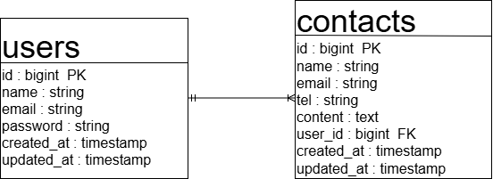

# contact-form3(お問い合わせフォーム)

## 概要　

お問い合わせフォームの練習用アプリです。

## 環境構築手順　

リポジトリをClone
``` git clone
    git@github.com:aki5538/contact-form3.git
    cd contact-form3
```

Dockerを起動
```
    docker compose up -d --build
```

envファイルの準備
```
    cp src/.env.example src/.env
```

Laravelのセットアップ
```
　　docker-compose exec php bash
    composer install
    php artisan migrate
    php artisan key:generate
```

## 使用技術（実行環境）
    -PHP 8.1
    -Laravel 8.75
    -MySQL 8.0

## ER図
    

## 動作URL
```
    -開発環境 : http://localhost/
    -phpMyAdmin : http://localhost:8080/
```
## ユーザー認証
```
    Fortifyを利用してユーザー認証機能を構築しています。
    
- ログイン画面（`/login`）
- 登録画面（`/register`）
- ログアウト機能
- 認証後のリダイレクト（`/home`）
- 認証保護されたページ（`/`, `/home`）

※ 未ログイン時は `/login` に自動リダイレクトされます。
```
## Fortify導入手順
```
    docker-compose exec php bash
    composer require laravel/fortify
    php artisan vendor:publish --provider="Laravel\Fortify\FortifyServiceProvider"
    php artisan migrate
```
## 日本語化
```
    docker-compose exec php bash
    composer require laravel-lang/lang:~7.0 --dev
    cp -r ./vendor/laravel-lang/lang/src/ja ./resources/lang/
```
